# Customer Service Agent — LangGraph Plan (Supervisor → Workers)

## Overview

- Goal: handle **returns/refunds** and **order status** end-to-end via a supervisor that routes across small, typed workers.
- Key capabilities: detect intent → collect order number → fetch order (Mongo) → show order status (if order_status) OR confirm with user → policy check → decide action → process return/refund → send email → finalize summary.
- Deterministic control flow: state-based routing, resumable, idempotent actions.
- **Multi-turn conversations**: Users can complete one flow (e.g., check status) then start another (e.g., return) in the same session.
- **Performance**: Template-based responses (Zendesk pattern) deliver 10-20x faster responses with 70% fewer LLM calls.

---

## Mermaid diagram (nodes & edges)

```mermaid
flowchart TD
    U[User Turn] --> SUP[Supervisor]

    SUP -->|intent missing OR conversation_complete| CI[ClassifyIntentWorker]
    SUP -->|need order_number| SF[SlotFillerWorker]
    SUP -->|have order_number and no order| OL[OrderLookupWorker]
    SUP -->|intent=order_status and order found| OS[ShowOrderStatusWorker]
    SUP -->|intent=return/refund and order not confirmed| CD[ConfirmDetailsWorker]
    SUP -->|eligibility unknown| PC[PolicyCheckWorker]
    SUP -->|desired_action unknown| DA[DecideActionWorker]
    SUP -->|action=return and no ticket| PR[ProcessReturnWorker]
    SUP -->|action=refund and no ticket| PF[ProcessRefundWorker]
    SUP -->|no email sent| EM[EmailWorker]
    SUP -->|conversation_complete=true| END[__end__]
    SUP --> FIN[FinalizeWorker]

    CI -->|sets intent| SUP
    SF -->|asks for order_number| SUP
    OL -->|fetches order| SUP
    OS -->|displays status| SUP
    CD -->|confirms with user| SUP
    PC -->|checks eligibility| SUP
    DA -->|decides action| SUP
    PR -->|creates RMA ticket| SUP
    PF -->|creates refund ticket| SUP
    EM -->|sends email| SUP
    FIN -->|sets conversation_complete=true| SUP
    END --> U
```



**Edge logic lives in Supervisor** (see routing table below). Each worker:
- reads the **State**
- writes to **State** (strict keys)
- returns control to **Supervisor**

---

## State schema (single source of truth)

```json
{
  "messages": [],
  "intent": null,
  "order_number": null,
  "order_match_confidence": null,
  "order": null,
  "user_confirmed_order": null,
  "eligibility": {
    "is_return_eligible": null,
    "is_refund_eligible": null,
    "reason": null,
    "policy_version": null,
    "cutoff_days": null,
    "computed_days_since_delivery": null
  },
  "desired_action": null,
  "action_ticket": {
    "id": null,
    "status": null
  },
  "email_status": null,
  "conversation_complete": null,
  "error": null,
  "meta": {
    "session_id": "",
    "idempotency_key": null,
    "locale": "en"
  }
}
```

> **Note:** keep workers pure where possible; side-effecting workers (DB, email) must be idempotent and attach errors to `state.error` instead of throwing uncaught exceptions.

### Key State Fields

- **`conversation_complete`**: Set to `true` by `FinalizeWorker` when a flow ends. This signals that the next user message should trigger re-classification and state reset, enabling multi-turn conversations.
- **`intent`**: One of `"return"`, `"refund"`, `"order_status"`, or `"other"`.
- **`messages`**: Uses `add_messages` reducer for proper checkpointing (appends messages across turns).

---

## Node contracts (I/O, side effects, success criteria)

### `Supervisor`
- **Reads:** entire `State`
- **Writes:** none (routes only)
- **Logic:** see "Routing Table"
- **Side effects:** none
- **Special handling**: 
  - Checks `conversation_complete` flag - if `true`, routes to `__end__`
  - For `order_status` intent, checks last message content to detect if status was already shown

### `ClassifyIntentWorker`
- **Reads:** latest user message, `conversation_complete` flag
- **Writes:** `intent` ∈ `{"return","refund","order_status","other"}`
- **Success:** Valid intent classified
- **LLM**: ✅ Yes (OpenAI GPT-4o-mini)
- **Multi-turn support**: If `conversation_complete=true`, resets 9 state fields and classifies new intent

### `SlotFillerWorker`
- **Reads:** `messages`, `order_number`, `intent`
- **Writes:** `order_number` (validated) **or** emits one targeted question
- **Success:** plausible ID captured, e.g. regex `^[A-Z0-9-]{6,}$`
- **LLM**: ✅ Yes (OpenAI GPT-4o-mini) for extraction
- **Template**: ✅ Yes - Uses template for asking questions

### `OrderLookupWorker`
- **Reads:** `order_number`
- **Writes:** `order` (normalized)
- **Side effects:** MongoDB query
- **Success:** `order != null`
- **LLM**: ❌ No
- **Errors:** set `error={code:"ORDER_NOT_FOUND"}`

### `ShowOrderStatusWorker` ⭐ NEW
- **Reads:** `order`
- **Writes:** `messages` (formatted status display)
- **Success:** Status displayed with tracking info
- **Template**: ✅ Yes (3 variations per status type)
- **LLM**: ❌ No
- **Format**: Bullet points with order #, status, dates, items, tracking
- **Notes**: Shows status directly, no confirmation needed

### `ConfirmDetailsWorker`
- **Reads:** `order`
- **Writes:** `user_confirmed_order` (true/false)
- **Success:** explicit yes/no captured
- **Template**: ✅ Yes (3 variations)
- **LLM**: ❌ No
- **Notes**: Only for return/refund flows, not order_status

### `PolicyCheckWorker`
- **Reads:** `order` (delivery/order date), config policy
- **Writes:** `eligibility{...}`
- **Success:** both `is_return_eligible` and `is_refund_eligible` set; include `reason`, `policy_version`, `cutoff_days`, `computed_days_since_delivery`
- **LLM**: ❌ No
- **Notes:** pure deterministic function

### `DecideActionWorker`
- **Reads:** `intent`, `eligibility`, user preference
- **Writes:** `desired_action` ∈ `{"return","refund","cancel"}`
- **Success:** `desired_action` set based on eligibility and user preference
- **Template**: ✅ Yes (different scenarios: both eligible, only return, only refund, neither)
- **LLM**: ❌ No

### `ProcessReturnWorker` / `ProcessRefundWorker`
- **Reads:** `order.order_id`, `desired_action`
- **Writes:** `action_ticket{id,status}`, `meta.idempotency_key`
- **Side effects:** create RMA/refund case (mock)
- **Success:** `action_ticket.status = "created" | "duplicate"`
- **LLM**: ❌ No
- **Idempotency:** returns same ticket on repeat

### `EmailWorker`
- **Reads:** `order.customer_email`, `action_ticket`, `desired_action`
- **Writes:** `email_status`
- **Side effects:** send email (mock)
- **Success:** `email_status="sent"`
- **LLM**: ❌ No

### `FinalizeWorker`
- **Reads:** everything
- **Writes:** summary message, **`conversation_complete=true`** ⭐
- **Success:** user sees confirmation, sets flag for multi-turn
- **Template**: ✅ Yes (ORDER_STATUS_CLOSING, SUCCESS_RETURN_TEMPLATE, SUCCESS_REFUND_TEMPLATE, etc.)
- **LLM**: ❌ No
- **Multi-turn**: Always sets `conversation_complete=true` and asks "Is there anything else I can help you with?"

---

## Routing table (deterministic order)

Evaluate in this order inside **Supervisor**:

1. **Error check**: If `error` is set → surface message, offer recovery or handoff
2. **Conversation complete check** ⭐: If `conversation_complete == true` → route to `__end__` (wait for new message)
3. **Order status special handling** ⭐: If `intent == "order_status"` AND `order` exists:
   - If last message contains status info (Order #, Status:, Delivery:) → route to **FinalizeWorker**
   - Else → route to **ShowOrderStatusWorker**
4. **Generic question check**: If last message has "?" or "please" → route to `__end__` (human-in-the-loop)
5. **Intent classification**: If `intent` is `null` → **ClassifyIntentWorker**
6. **Slot filling**: If `intent ∈ {"return","refund","order_status"}` AND `order_number` missing → **SlotFillerWorker**
7. **Order lookup**: If `order_number` exists AND `order == null` → **OrderLookupWorker**
8. **Confirm details**: If `intent ∈ {"return","refund"}` AND `order` exists AND `user_confirmed_order !== true` → **ConfirmDetailsWorker**
9. **User declined**: If `user_confirmed_order == false` → **FinalizeWorker**
10. **Policy check**: If `user_confirmed_order == true` AND `eligibility` not set → **PolicyCheckWorker**
11. **Not eligible**: If `eligibility.eligible == false` → **FinalizeWorker**
12. **Decide action**: If eligible AND `desired_action == null` → **DecideActionWorker**
13. **Process return**: If `desired_action == "return"` AND no ticket → **ProcessReturnWorker**
14. **Process refund**: If `desired_action == "refund"` AND no ticket → **ProcessRefundWorker**
15. **Send email**: If ticket exists AND `email_status != "sent"` → **EmailWorker**
16. **Finalize**: If `email_status == "sent"` OR `intent == "other"` → **FinalizeWorker**
17. **Fallback**: → **FinalizeWorker**

**Key routing improvements:**
- ⭐ **Multi-turn support**: Checks `conversation_complete` flag to stop processing after flow ends
- ⭐ **Order status path**: Simplified routing directly to `ShowOrderStatusWorker` then `FinalizeWorker`
- **Human-in-the-loop**: Detects questions and pauses for user input
- **Error recovery**: Early check for error state with graceful handling

**Error short-circuits:**
- If `error` is set by a worker, Supervisor should surface a friendly message and either:
  - route to a recovery node (e.g., ask to re-enter order number), or
  - offer human handoff, then clear `error` once addressed.

---

## Policy module (pure functions)

```ts
type EligibilityInput = {
  delivery_date: string,
  order_status: string,
  category?: string
}
type EligibilityOutput = {
  is_return_eligible: boolean,
  is_refund_eligible: boolean,
  reason: string,
  cutoff_days: number,
  computed_days_since_delivery: number,
  policy_version: string
}
```

- Example config: `RETURN_WINDOW_DAYS=30`, `REFUND_WINDOW_DAYS=14`, overrides by `category`.
- Must be **unit-tested** with fixtures (boundary dates, already-returned, non-delivered).

---

## Message patterns (prompting guidance)

### Template-based responses (9 of 11 workers)

**Pattern: Zendesk-style template variations**
- Each scenario has 3+ template variations for natural variety
- Random selection on each use prevents robotic repetition
- No LLM calls = 10-20x faster responses (<500ms vs 5-10s)

### Worker-specific patterns

- **SlotFillerWorker ask:**  
  "I can help with that. What's your **order number**? It usually looks like **ABC-123456**."

- **ShowOrderStatusWorker (NEW):** ⭐  
  Template variations include:
  - "Here's the status of your order:"
  - "I found your order! Here are the details:"
  - "Let me pull up that information for you:"
  
  Followed by formatted bullet points with order details.

- **ConfirmDetailsWorker ask:**  
  "I found order **#{{order_number}}** from **{{order_date}}** with **{{item_names}}**. Is this the correct order? **Yes/No**"

- **DecideActionWorker ask (both eligible):**  
  "This order qualifies for a **return** (30-day window) and a **refund** (14-day window). Which would you like to proceed with?"

- **FinalizeWorker say:**  
  - For returns/refunds: "Done — I've created a **{{desired_action}}** ticket **{{ticket_id}}**. I've emailed **{{masked_email}}** with next steps."
  - For order status: "Is there anything else I can help you with today?"
  - Always includes multi-turn prompt to continue conversation

> Keep workers' outputs structured; UI copy should be short and action-oriented.

---

## Persistence & idempotency

- **Conversations** collection: state snapshots or diffs per turn (with `session_id`, `trace_id`).
- **Actions** collection: `{ idempotency_key, order_id, action, ticket_id, status, ts }`.
- **Idempotency rule:** `idempotency_key = sha256(order_id + "|" + desired_action)`; return existing ticket if key exists.

---

## Test matrix (minimal but meaningful)

### Core flows
1. **Happy path (return)**: inside 30 days → return → email sent → finalize.
2. **Refund eligible only**: within 14 days → refund flow.
3. **Order status check** ⭐: user asks for status → show status → finalize (no confirmation needed).
4. **Not found → recovery**: bad order number → re-ask → success.
5. **Duplicate submit**: same order/action twice → returns same ticket.
6. **Email failure**: email provider down → user informed, retry offered.
7. **User says "No" at confirm**: ask for another order number.

### Multi-turn conversation scenarios ⭐
8. **Status then return**: User checks order status → conversation_complete → user asks to return → new flow starts with state reset.
9. **Return then status**: User initiates return → completes flow → asks about different order status → new classification.
10. **Sequential different orders**: User returns order A → completes → returns order B → both processed correctly.

### Template variation testing
11. **Template randomness**: Same scenario multiple times → different template variations used.
12. **Template correctness**: All templates populate variables correctly (no {{undefined}}).

---

## Implementation notes for Copilot (help it help you)

- Define **State** with a Pydantic model (or TypedDict) and pass it through nodes explicitly.
- Each Worker = a **LangGraph node** with a narrow signature:
  - `def run(state: State) -> State` (sync) or `async def run(state: State) -> State`.
- **No hidden globals**; inject services (Mongo client, EmailService) via constructor or dependency map.
- Put **routing** in Supervisor only. Workers never call other workers.
- Keep **PolicyCheckWorker** 100% pure (easy unit tests, no I/O).
- For Mongo, use **Motor**; normalize BSON → dict with only what you need.

### Architecture decisions

**Template-based responses (Zendesk pattern):**
- Only 2 workers use LLMs: `ClassifyIntentWorker` (intent classification), `SlotFillerWorker` (order number extraction)
- 9 workers use templates: `ShowOrderStatusWorker`, `ConfirmDetailsWorker`, `DecideActionWorker`, `FinalizeWorker`, `ProcessReturnWorker`, `ProcessRefundWorker`, `EmailWorker`, `OrderLookupWorker`, `PolicyCheckWorker`
- Result: 70% fewer LLM calls, 10-20x faster responses
- Trade-off: Less flexibility, but acceptable for structured flows

**Multi-turn conversation support:**
- `FinalizeWorker` sets `conversation_complete=true` after every flow
- `ClassifyIntentWorker` checks flag and resets 9 state fields if true
- State reset fields: `intent`, `order_number`, `order`, `user_confirmed_order`, `eligibility`, `desired_action`, `action_ticket`, `email_status`, `error`
- Preserves: `messages` (conversation history), `meta.session_id` (session continuity)

---

### Example turn-by-turn flows

**Happy path (return)**
1) User: "I want to return my order" → **ClassifyIntentWorker** → `intent="return"`
2) **SlotFillerWorker** asks for order number → user provides
3) **OrderLookupWorker** fetches order
4) **ConfirmDetailsWorker** asks Yes/No → user "Yes"
5) **PolicyCheckWorker** computes eligibility
6) **DecideActionWorker** (already "return") → confirm
7) **ProcessReturnWorker** creates RMA (idempotent)
8) **EmailWorker** sends confirmation
9) **FinalizeWorker** closes with summary, sets `conversation_complete=true`

**Order status (new)** ⭐
1) User: "Where's my order?" → **ClassifyIntentWorker** → `intent="order_status"`
2) **SlotFillerWorker** asks for order number → user provides
3) **OrderLookupWorker** fetches order
4) **ShowOrderStatusWorker** displays formatted status (no confirmation needed)
5) **FinalizeWorker** asks "Anything else?", sets `conversation_complete=true`

**Multi-turn (status then return)** ⭐
1-5) [Order status flow completes as above]
6) User: "Actually I want to return it" → **Supervisor** sees `conversation_complete=true` → routes to **ClassifyIntentWorker**
7) **ClassifyIntentWorker** resets 9 state fields, classifies new intent → `intent="return"`
8-15) [Return flow proceeds as normal happy path]

---